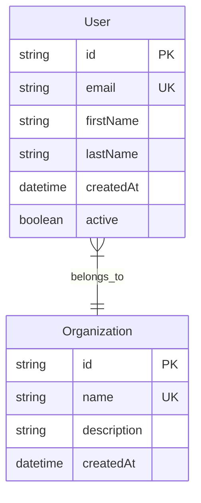

# Task 02: External API Analysis and Data Model Mapping

## Prerequisites

**🚨 CRITICAL**: Before starting this task, read `CLAUDE.md` to understand the project structure, rules, and requirements.

## Overview

This task performs comprehensive AI-powered analysis of the target API to create a visual data model diagram showing all entities, relationships, and API structure. This provides a foundational understanding before detailed operation mapping in Task 03.

## Input Requirements

- Task 01 output file: `.claude/.localmemory/{action}-{module-identifier}/task-01-output.json`
- Where `{module-identifier}` is the product identifier derived from the identified product package (e.g., `vendor-suite-service` from `@scope/product-vendor-suite-service`, or `vendor-service` from `@scope/product-vendor-service`)
- Target API documentation URL and basic service information

## Process Steps

### 0. Context Management and Goal Reminder

**🚨 MANDATORY FIRST STEP - CONTEXT CLEARING**: 
- **IGNORE all previous conversation context** - This task runs in isolation
- **CLEAR mental context** - Treat this as a fresh start with no prior assumptions
- **REQUEST**: User should run `/clear` or `/compact` command before starting this task for optimal performance

**🚨 MANDATORY SECOND STEP**: Read and understand the original user intent:

1. **Read initial user prompt**:
   - Load `.claude/.localmemory/{action}-{module-identifier}/task-01-output.json`
   - Where `{module-identifier}` is derived from the product package (see Task 01 for derivation rules)
   - Extract and review the `initialUserPrompt` field
   - Understand the original goal, scope, and specific user requirements

2. **Goal alignment verification**:
   - Ensure all API analysis decisions align with the original user request
   - Keep the user's specific intentions and scope in mind throughout the task
   - If any conflicts arise between task instructions and user intent, prioritize user intent

3. **Context preservation**:
   - Reference the original prompt when determining analysis scope and focus
   - Ensure the external API analysis serves the user's actual needs, not generic assumptions

### 1. Load Service Configuration

Extract service information from Task 01 output:
- **Service Name**: Primary service name
- **Base URL**: API base URL for analysis
- **API Documentation URL**: Primary documentation source
- **Main Documentation URL**: Additional documentation sources

### 2. AI-Powered Comprehensive API Analysis

Use AI agent to perform deep analysis of the target API:

**🚨 MANDATORY: Use Task Tool for AI Analysis**

Launch a general-purpose AI agent with the following comprehensive analysis requirements:

**Agent Task Specification:**
```markdown
Perform comprehensive external API analysis for {SERVICE_NAME} and generate a complete Mermaid entity relationship diagram.

CRITICAL REQUIREMENTS:
1. **Access ALL API documentation sources** - don't limit to just one page
2. **Map ALL data entities** - users, organizations, projects, resources, etc.
3. **Identify ALL relationships** - parent-child, many-to-many, references, etc.
4. **Document API structure** - REST endpoints, GraphQL schemas, authentication methods
5. **Capture field types** - strings, numbers, dates, enums, arrays, objects
6. **Note required vs optional fields** for each entity
7. **Identify pagination patterns** - how list operations work
8. **Document authentication flows** - what credentials are needed
9. **Map error responses** - common error codes and structures
10. **Find nested resources** - hierarchical data structures

ANALYSIS SOURCES:
- Primary API documentation: {API_DOCUMENTATION_URL}
- Service base URL: {BASE_URL}
- Additional docs: {MAIN_DOCUMENTATION_URL}

MERMAID DIAGRAM REQUIREMENTS:
- Use erDiagram format for data models
- Show entity relationships with proper cardinality
- Include key field types and constraints
- Use clear, descriptive entity names
- Show inheritance/composition relationships where applicable
- Include authentication and error entities

OUTPUT FORMAT:
1. **Analysis Summary** - Key findings and API structure overview
2. **Mermaid Diagram** - Complete erDiagram with all entities and relationships
3. **Entity Documentation** - Detailed description of each entity and its purpose
4. **API Capabilities Summary** - What operations are available
5. **Authentication Summary** - How to authenticate and what credentials are needed

EXAMPLE MERMAID FORMAT:


Focus on completeness and accuracy - this diagram will be referenced by other tasks for implementation decisions.
```

### 3. Generate External API Analysis File

Create the comprehensive API analysis output:

**File**: `{module_path}/external-api.mmd`

**File Structure:**
```markdown
# {Service Name} External API Analysis

## Analysis Summary
[AI-generated summary of key findings]

## API Capabilities
[Overview of what the API can do]

## Authentication Method
[How authentication works]

## Data Model Relationships
```mermaid
erDiagram
[AI-generated complete entity relationship diagram]
```

## Entity Documentation
[Detailed description of each entity from the diagram]

## API Endpoint Structure
[Overview of REST/GraphQL endpoint patterns]

## Pagination and Filtering
[How list operations work]

## Common Error Responses
[Standard error patterns and codes]

---
📋 **Important**: This analysis is AI-generated from external API documentation. Always verify details against the official API documentation during implementation.
```

### 4. Create Analysis Reference Guide

Store analysis metadata for other tasks to reference:

**Key Information to Capture:**
- Total entities discovered
- Key relationship patterns  
- Authentication method identified
- API structure type (REST, GraphQL, etc.)
- Pagination patterns found
- Error handling patterns

## Output Format

Store the following JSON in memory file: `.claude/.localmemory/{action}-{module-identifier}/task-02-output.json`

```json
{
  "status": "completed|failed|error",
  "externalApiAnalysis": {
    "timestamp": "${iso_timestamp}",
    "serviceName": "${service_name}",
    "apiDocumentationUrl": "${api_documentation_url}",
    "baseUrl": "${base_url}",
    "analysisFile": {
      "path": "${module_path}/external-api.mmd",
      "status": "created|failed"
    },
    "aiAnalysisResults": {
      "entitiesDiscovered": "${entity_count}",
      "relationshipsMapped": "${relationship_count}",
      "authenticationMethod": "${auth_method_discovered}",
      "apiStructureType": "${api_type}",
      "paginationPatterns": "${pagination_info}",
      "errorHandlingPatterns": "${error_patterns}"
    },
    "analysisMetadata": {
      "analysisMethod": "ai_powered_comprehensive",
      "documentationSourcesAnalyzed": ["${list_of_sources}"],
      "analysisScopeComplete": "${boolean_complete_analysis}"
    }
  }
}
```

## Error Conditions

- **Task 01 output not found**: Stop execution, Task 01 must be completed first
- **API documentation not accessible**: Stop execution, report documentation access issue
- **AI analysis failed**: Retry analysis or create manual analysis with justification
- **Mermaid diagram generation failed**: Stop execution, fix diagram syntax issues

## Success Criteria

- AI-powered comprehensive analysis completed successfully
- Complete Mermaid entity relationship diagram generated
- All major data entities and relationships documented
- Authentication method and API structure identified
- External API analysis file (`external-api.mmd`) created in module directory
- Analysis metadata stored for reference by subsequent tasks
- Documentation includes appropriate disclaimers about verification needs

## Reference Usage for Other Tasks

**How subsequent tasks should use this analysis:**

```markdown
### Quick API Overview Reference
For a visual overview of data models and relationships, see `external-api.mmd`.

**⚠️ IMPORTANT**: This diagram is for reference only. Always verify details against the official API documentation - use the mermaid analysis as a starting point, not the authoritative source.
```

## Task Integration Notes

**For Task 03 (API Analysis and Operation Mapping):**
- Use `external-api.mmd` to understand entity relationships when mapping operations
- Reference the analysis to identify missing operations or edge cases
- Verify all findings against actual API documentation

**For Task 06 (API Definition):**
- Reference entity structures when creating OpenAPI schemas
- Use relationship information to design proper API endpoint hierarchies
- Validate field types and constraints against mermaid analysis

**For Task 07 (Implementation):**
- Use entity relationships to understand data flow requirements
- Reference authentication patterns for client implementation
- Validate mapper logic against documented entity structures

## Important Disclaimers

1. **Verification Required**: All information in the analysis must be verified against official API documentation during implementation
2. **Reference Only**: The mermaid diagram serves as a visual aid and starting point, not the definitive specification
3. **Accuracy Limitation**: AI analysis may miss nuances or recent changes - always double-check critical details
4. **Implementation Authority**: Official API documentation takes precedence over this analysis in all implementation decisions