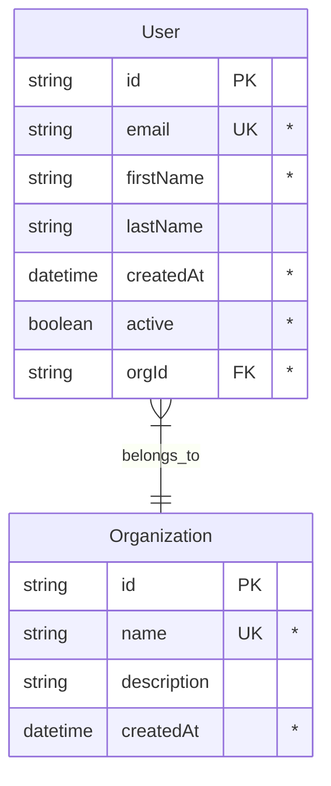
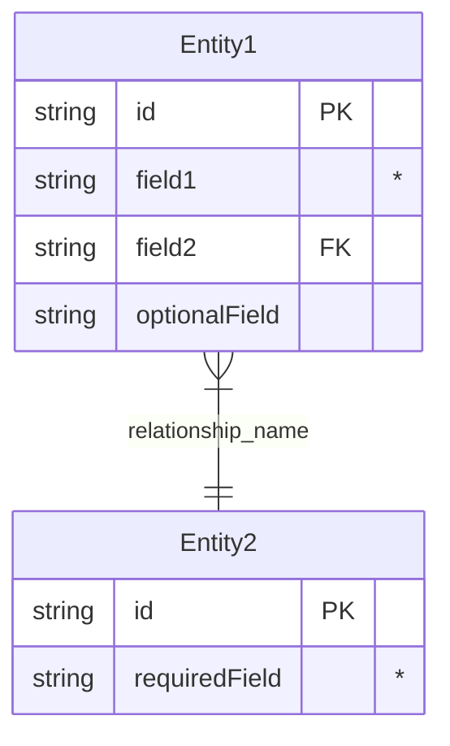

# Task 02: External API Analysis and Data Model Mapping

## Prerequisites

**🚨 CRITICAL**: Before starting this task, read `CLAUDE.md` to understand the project structure, rules, and requirements.

## Overview

This task performs comprehensive AI-powered analysis of the target API to create a visual data model diagram showing all entities, relationships, and API structure. This provides a foundational understanding before detailed operation mapping in Task 03.

## Input Requirements

- Task 01 output file: `.claude/.localmemory/{action}-{module-identifier}/task-01-output.json`
- Where `{module-identifier}` is the product identifier derived from the identified product package (e.g., `vendor-suite-service` from `@scope/product-vendor-suite-service`, or `vendor-service` from `@scope/product-vendor-service`)
- Target API documentation URL and basic service information

## Process Steps

### 0. Context Management and Goal Reminder

**🚨 MANDATORY FIRST STEP - CONTEXT CLEARING**: 
- **IGNORE all previous conversation context** - This task runs in isolation
- **CLEAR mental context** - Treat this as a fresh start with no prior assumptions
- **REQUEST**: User should run `/clear` or `/compact` command before starting this task for optimal performance

**🚨 MANDATORY SECOND STEP**: Read and understand the original user intent:

1. **Read initial user prompt**:
   - Load `.claude/.localmemory/{action}-{module-identifier}/task-01-output.json`
   - Where `{module-identifier}` is derived from the product package (see Task 01 for derivation rules)
   - Extract and review the `initialUserPrompt` field
   - Understand the original goal, scope, and specific user requirements

2. **Goal alignment verification**:
   - Ensure all API analysis decisions align with the original user request
   - Keep the user's specific intentions and scope in mind throughout the task
   - If any conflicts arise between task instructions and user intent, prioritize user intent

3. **Context preservation**:
   - Reference the original prompt when determining analysis scope and focus
   - Ensure the external API analysis serves the user's actual needs, not generic assumptions

### 1. Load Service Configuration

Extract service information from Task 01 output:
- **Service Name**: Primary service name
- **Base URL**: API base URL for analysis
- **API Documentation URL**: Primary documentation source
- **Main Documentation URL**: Additional documentation sources

### 2. AI-Powered Comprehensive API Analysis

Use AI agent to perform deep analysis of the target API:

**🚨 MANDATORY: Use Task Tool for AI Analysis**

Launch a general-purpose AI agent with the following comprehensive analysis requirements:

**Agent Task Specification:**
```markdown
Perform comprehensive external API analysis for {SERVICE_NAME} and generate a complete Mermaid entity relationship diagram with ALL entities, properties, and relationships.

🚨 CRITICAL OUTPUT FORMAT REQUIREMENT:
When you provide the Mermaid diagram in your response, give me TWO versions:
1. **Analysis Summary** with explanations and context
2. **Pure Mermaid Content** - this will be saved directly to the .mmd file

For the Pure Mermaid Content section, provide ONLY the erDiagram syntax with NO markdown backticks, NO "```mermaid" headers, NO explanations - just the raw Mermaid diagram starting with "erDiagram" and ending with the last relationship.

🚨 ULTRA-CRITICAL COMPLETENESS REQUIREMENTS - FAILURE TO FOLLOW = TASK FAILURE:

**PHASE 1: MANDATORY SYSTEMATIC ENDPOINT DISCOVERY**
1. **EXHAUSTIVE NAVIGATION MAP**: Start at documentation root, create complete site map of ALL pages/sections
2. **PER-PAGE ANALYSIS REQUIREMENT**: Visit EVERY SINGLE page in the documentation navigation tree
3. **ENDPOINT EXTRACTION MANDATE**: From each page, extract ALL HTTP endpoints with full method + path
4. **SCHEMA EXTRACTION MANDATE**: For each endpoint, extract complete request/response schemas
5. **NESTED ANALYSIS REQUIREMENT**: Follow ALL schema references to discover nested/related entities

**PHASE 2: MANDATORY ENTITY ENUMERATION**  
1. **COMPLETE ENDPOINT INVENTORY**: Provide ALPHABETICAL list of ALL HTTP endpoints found
2. **COMPLETE ENTITY CATALOG**: Provide ALPHABETICAL list of ALL entity types discovered  
3. **SCHEMA PROPERTY INVENTORY**: For each entity, list ALL properties with types and constraints
4. **RELATIONSHIP INVENTORY**: Map ALL foreign key relationships between entities

**PHASE 3: MANDATORY VERIFICATION CHECKPOINTS**
1. **NAVIGATION COMPLETENESS**: Confirm you visited every page in the documentation site
2. **ENDPOINT COMPLETENESS**: Confirm you examined every HTTP endpoint for schemas
3. **ENTITY COMPLETENESS**: Confirm every schema property was captured
4. **CROSS-REFERENCE VERIFICATION**: Confirm no entity mentioned anywhere is missing from diagram

**🚨 MANDATORY ENTITY DISCOVERY PROCESS - EACH STEP REQUIRED:**
1. **Complete Site Navigation**: Map entire documentation structure before analysis
2. **Page-by-Page Crawl**: Visit every single page, not just endpoint pages  
3. **Per-Endpoint Schema Analysis**: Extract complete request/response schemas for every operation
4. **Property-Level Extraction**: Capture every single property, nested object, array element schema
5. **Cross-Schema Validation**: Verify all referenced entity types exist in your model
6. **Example Analysis**: Check all code examples for additional entity references
7. **Error Schema Analysis**: Include error response schemas and status entities

🚨 ULTRA-CRITICAL COMPLETENESS VERIFICATION CHECKLIST - ALL MUST BE ✅:
- [ ] **NAVIGATION COMPLETENESS**: Mapped complete documentation site structure
- [ ] **PAGE COMPLETENESS**: Visited every single documentation page (not just endpoints)
- [ ] **ENDPOINT COMPLETENESS**: Found and analyzed ALL HTTP endpoints in the API
- [ ] **SCHEMA COMPLETENESS**: Extracted complete request/response schemas for every endpoint
- [ ] **PROPERTY COMPLETENESS**: Captured every property of every schema (no abbreviated models)
- [ ] **NESTED COMPLETENESS**: Followed all nested object references to their full definitions
- [ ] **ARRAY COMPLETENESS**: Analyzed array element schemas and item types  
- [ ] **REFERENCE COMPLETENESS**: Resolved all $ref and allOf/oneOf schema references
- [ ] **EXAMPLE COMPLETENESS**: Checked all code examples for additional entity references
- [ ] **ERROR COMPLETENESS**: Included error response schemas and error entity types
- [ ] **RELATIONSHIP COMPLETENESS**: Mapped all foreign key and association relationships
- [ ] **CROSS-REFERENCE VERIFICATION**: Verified no entity mentioned anywhere is missing
- [ ] **ENUMERATION VERIFICATION**: Captured all enum values and constant definitions

🚨 COMMONLY MISSED RESOURCE TYPES - MANDATORY VERIFICATION REQUIRED:

**CORE SYSTEM ENTITIES (verify existence):**
- **Authentication**: tokens, sessions, credentials, oauth, api-keys
- **Authorization**: roles, permissions, scopes, policies, rules
- **Organizations**: accounts, tenants, workspaces, organizations
- **Users**: users, identities, profiles, contacts, members

**PHYSICAL ACCESS ENTITIES (verify for access control systems):**
- **Hardware**: controllers, readers, sensors, devices, gateways
- **Locations**: sites, buildings, zones, areas, rooms, entries, doors
- **Access Control**: groups, schedules, holidays, time-zones
- **Visitors**: visitors, invitations, escorts, temporary-access
- **Emergency**: lockdown-plans, evacuation-plans, muster-points

**OPERATIONAL ENTITIES (commonly missed):**
- **Configuration**: settings, preferences, configurations, templates
- **Integration**: webhooks, apis, connectors, sync-jobs, integrations  
- **Monitoring**: alerts, notifications, events, logs, analytics
- **Reporting**: reports, dashboards, metrics, statistics
- **Maintenance**: firmware-updates, backups, device-health
- **Compliance**: audit-logs, compliance-policies, certifications

**BUSINESS ENTITIES (often overlooked):**
- **Billing**: plans, subscriptions, usage, invoices, payments
- **Communication**: emails, sms, templates, messages, notifications
- **Assets**: cards, badges, formats, layouts, printing
- **Workflow**: approvals, requests, tasks, workflows
- **Data Management**: imports, exports, migrations, archives

**VERIFICATION REQUIREMENT**: For each category above, you MUST explicitly verify whether entities of that type exist in the API. Document findings for each category with either "Found: [entity names]" or "Not Found: [category verified but no entities exist]".

DETAILED REQUIREMENTS:
1. **Access ALL API documentation sources** - don't limit to just one page or section
2. **Map ALL data entities** - every single entity type the API provides, including system entities
3. **Include ALL properties** - every field for every entity with proper type information
4. **Mark ALL property flags** - PK (Primary Key), FK (Foreign Key), * (Required)
5. **Identify ALL relationships** - parent-child, many-to-many, references, associations
6. **Document API structure** - REST endpoints, authentication methods
7. **Capture field types** - strings, numbers, dates, enums, arrays, objects
8. **Note required vs optional fields** for each entity
9. **Identify pagination patterns** - how list operations work
10. **Document authentication flows** - what credentials are needed
11. **Map error responses** - common error codes and structures
12. **Find nested resources** - hierarchical data structures

ANALYSIS SOURCES:
- Primary API documentation: {API_DOCUMENTATION_URL}
- Service base URL: {BASE_URL}
- Additional docs: {MAIN_DOCUMENTATION_URL}

MERMAID DIAGRAM REQUIREMENTS:
- Use erDiagram format for data models
- **INCLUDE ALL ENTITY TYPES** from the API - not just what seems important
- Show entity relationships with proper cardinality
- **ALL PROPERTIES** must be included for each entity
- **PROPER PROPERTY FLAGS**: PK (Primary Key), FK (Foreign Key), * (Required)
- Include key field types and constraints
- Use clear, descriptive entity names
- Show inheritance/composition relationships where applicable
- Include authentication and error entities
- **ALL LINKS/RELATIONSHIPS** between models must be documented

🚨 MANDATORY OUTPUT FORMAT - ALL SECTIONS REQUIRED FOR TASK COMPLETION:

**SECTION 1: DOCUMENTATION NAVIGATION PROOF**
- Complete site map of documentation structure  
- List of every page visited during analysis
- Confirmation that entire site was systematically analyzed

**SECTION 2: COMPLETE ENDPOINT INVENTORY** 
- ALPHABETICAL list of ALL HTTP endpoints (METHOD /path format)
- For each endpoint: request entities, response entities, query params
- Total endpoint count and verification of completeness

**SECTION 3: COMPLETE ENTITY CATALOG**
- ALPHABETICAL list of ALL entity types found in the API (minimum 40+ for comprehensive APIs)
- For each entity: source endpoint(s), key properties, relationships
- Entity count verification against comprehensive system expectations  

**SECTION 4: CATEGORICAL VERIFICATION REPORT**
- For each entity category in "COMMONLY MISSED" section above:
  - "Found: [list of entity names]" OR "Verified Not Present: [category checked]"
- This PROVES you checked every category systematically

**SECTION 5: COMPLETE MERMAID DIAGRAM**
- Complete erDiagram with ALL entities, ALL properties, ALL relationships
- Every entity must have complete property list (no abbreviated models)
- All relationships must be properly mapped with cardinality

**SECTION 6: COMPLETENESS VERIFICATION EVIDENCE**
- ✅/❌ status for each item in the ULTRA-CRITICAL COMPLETENESS VERIFICATION CHECKLIST
- Evidence/proof for each completed checklist item
- Final entity count and justification for why this represents complete coverage

**SECTION 7: PURE MERMAID CONTENT** 
- Raw Mermaid syntax ready for direct copy-paste to .mmd file
- NO markdown formatting, NO explanations, ONLY pure erDiagram syntax

EXAMPLE MERMAID FORMAT:


**🚨 CRITICAL PROPERTY FLAG REQUIREMENTS**:
- Use PK for primary keys
- Use FK for foreign keys  
- Use * to mark required fields
- Include ALL properties discovered in API documentation

Focus on completeness and accuracy - this diagram will be referenced by other tasks for implementation decisions.
```

### 3. Generate External API Analysis File

Create the comprehensive API analysis output:

**🚨 CRITICAL PATH REQUIREMENT**: The file MUST be created in the existing module directory under `/package/vendor/product/service/` structure. 

**MANDATORY STEP - Module Directory Location**:
1. **First, locate the existing module directory using LS tool**: 
   - Search in `/package/` for directories matching the vendor/service pattern
   - Look for existing module structure based on the service name from Task 01 output
2. **Module Path Derivation Rules**:
   - **Expected structure**: `/package/{vendor}/{suite}/{service}/` or `/package/{vendor}/{service}/`
   - **File location**: `{existing_module_directory_full_path}/external-api.mmd`
   - **NEVER create in root**: Do NOT create the file in a new directory at the repository root level
3. **Verification**: Use LS tool to confirm the target directory exists before creating the file

**Example**: For avigilon-alta-access, first run:
```bash
LS /Users/ctamas/code/zborg/module/package/avigilon/
```
Then create file at: `/Users/ctamas/code/zborg/module/package/avigilon/alta/access/external-api.mmd`

**🚨 CRITICAL FILE FORMAT REQUIREMENT**: 
The .mmd file MUST contain ONLY pure Mermaid diagram content - NO markdown headers, explanations, or other text. This file will be loaded directly into Mermaid Live editor.

**File Structure:**


**🚨 MANDATORY CONTENT REQUIREMENTS**:
- ONLY Mermaid erDiagram syntax
- NO markdown headers or documentation text
- Include ALL entity types discovered in API
- Include ALL properties for each entity
- Mark ALL primary keys with PK
- Mark ALL foreign keys with FK  
- Mark ALL required fields with *
- Include ALL relationships between entities
- Use proper cardinality notation

### 4. Comprehensive Verification and Gap Analysis

**🚨 MANDATORY VERIFICATION STEP**: After creating the initial external-api.mmd file, perform comprehensive cross-validation to ensure NO entities are missing.

**VERIFICATION PROCESS**:

1. **API Definition Analysis** (if available):
   - Look for existing API definition files (api.yml, openapi.yaml, swagger.json) in the module directory
   - If found, parse ALL operation responses and identify ALL entity types mentioned
   - Compare with current Mermaid diagram entities

2. **Existing Generated Code Analysis**:
   - Check for `/generated/model/` directory in the module
   - If exists, list ALL TypeScript model files (*.ts)
   - Each model file represents a potential entity type
   - Compare ALL model names with Mermaid diagram entities

3. **Cross-Reference Verification**:
   - Create comprehensive list of ALL entities from steps 1-2
   - Compare against entities in current Mermaid diagram
   - Identify ANY missing entities not in the diagram

4. **Gap Resolution**:
   - For each missing entity identified:
     - Research the entity in API documentation
     - Add complete entity definition to Mermaid diagram
     - Include ALL properties with proper flags (PK, FK, *)
     - Add relationships to other entities
   - Update the external-api.mmd file with missing entities

5. **Final Verification Loop**:
   - Re-run the verification process after additions
   - Ensure NO entities remain missing
   - Repeat until 100% completeness achieved

**🚨 VERIFICATION COMMANDS TO RUN**:

```bash
# Check for existing API definition
LS {module_directory}/ | grep -E "(api\.yml|openapi\.yaml|swagger\.json)"

# Check for generated models
LS {module_directory}/generated/model/ 2>/dev/null || echo "No generated models found"

# List all TypeScript model files if they exist
find {module_directory}/generated/model/ -name "*.ts" -not -name "index.ts" 2>/dev/null | sort
```

**VERIFICATION OUTPUT REQUIREMENTS**:
- List of ALL entities found in API definitions/generated models
- List of entities currently in Mermaid diagram  
- List of ANY missing entities (should be empty after completion)
- Confirmation that verification passed with 100% completeness

### 5. Create Analysis Reference Guide

Store analysis metadata for other tasks to reference:

**Key Information to Capture:**
- Total entities discovered
- Key relationship patterns  
- Authentication method identified
- API structure type (REST, GraphQL, etc.)
- Pagination patterns found
- Error handling patterns

## Output Format

Store the following JSON in memory file: `.claude/.localmemory/{action}-{module-identifier}/task-02-output.json`

```json
{
  "status": "completed|failed|error",
  "externalApiAnalysis": {
    "timestamp": "${iso_timestamp}",
    "serviceName": "${service_name}",
    "apiDocumentationUrl": "${api_documentation_url}",
    "baseUrl": "${base_url}",
    "analysisFile": {
      "path": "${existing_module_directory_full_path}/external-api.mmd",
      "status": "created|failed"
    },
    "aiAnalysisResults": {
      "entitiesDiscovered": "${entity_count}",
      "relationshipsMapped": "${relationship_count}",
      "authenticationMethod": "${auth_method_discovered}",
      "apiStructureType": "${api_type}",
      "paginationPatterns": "${pagination_info}",
      "errorHandlingPatterns": "${error_patterns}"
    },
    "analysisMetadata": {
      "analysisMethod": "ai_powered_comprehensive",
      "documentationSourcesAnalyzed": ["${list_of_sources}"],
      "analysisScopeComplete": "${boolean_complete_analysis}"
    },
    "verificationResults": {
      "verificationCompleted": "${boolean_verification_completed}",
      "apiDefinitionFound": "${boolean_api_definition_exists}",
      "generatedModelsFound": "${boolean_generated_models_exist}",
      "entitiesFromApiDefinition": ["${list_of_entities_from_api}"],
      "entitiesFromGeneratedModels": ["${list_of_entities_from_models}"],
      "entitiesInMermaidDiagram": ["${list_of_entities_in_diagram}"],
      "missingEntitiesFound": ["${list_of_missing_entities_should_be_empty}"],
      "gapsResolved": "${boolean_all_gaps_resolved}",
      "finalEntityCount": "${final_total_entity_count}",
      "verificationPassed": "${boolean_100_percent_complete}"
    }
  }
}
```

## Error Conditions

- **Task 01 output not found**: Stop execution, Task 01 must be completed first
- **API documentation not accessible**: Stop execution, report documentation access issue
- **AI analysis failed**: Retry analysis or create manual analysis with justification
- **Mermaid diagram generation failed**: Stop execution, fix diagram syntax issues

## Success Criteria

- AI-powered comprehensive analysis completed successfully
- Complete Mermaid entity relationship diagram generated
- All major data entities and relationships documented
- Authentication method and API structure identified
- External API analysis file (`external-api.mmd`) created in correct module directory
- **🚨 MANDATORY**: Comprehensive verification completed with 100% entity completeness
- Cross-validation against existing API definitions and generated models performed
- All missing entities identified and added to Mermaid diagram
- Verification results show NO missing entities (empty missingEntitiesFound array)
- Final verification confirms all entities from API operations are included
- Analysis metadata stored for reference by subsequent tasks
- Documentation includes appropriate disclaimers about verification needs

## Reference Usage for Other Tasks

**How subsequent tasks should use this analysis:**

```markdown
### Quick API Overview Reference
For a visual overview of data models and relationships, see `external-api.mmd`.

**⚠️ IMPORTANT**: This diagram is for reference only. Always verify details against the official API documentation - use the mermaid analysis as a starting point, not the authoritative source.
```

## Task Integration Notes

**For Task 03 (API Analysis and Operation Mapping):**
- Use `external-api.mmd` to understand entity relationships when mapping operations
- Reference the analysis to identify missing operations or edge cases
- Verify all findings against actual API documentation

**For Task 06 (API Definition):**
- Reference entity structures when creating OpenAPI schemas
- Use relationship information to design proper API endpoint hierarchies
- Validate field types and constraints against mermaid analysis

**For Task 07 (Implementation):**
- Use entity relationships to understand data flow requirements
- Reference authentication patterns for client implementation
- Validate mapper logic against documented entity structures

## Important Disclaimers

1. **Verification Required**: All information in the analysis must be verified against official API documentation during implementation
2. **Reference Only**: The mermaid diagram serves as a visual aid and starting point, not the definitive specification
3. **Accuracy Limitation**: AI analysis may miss nuances or recent changes - always double-check critical details
4. **Implementation Authority**: Official API documentation takes precedence over this analysis in all implementation decisions