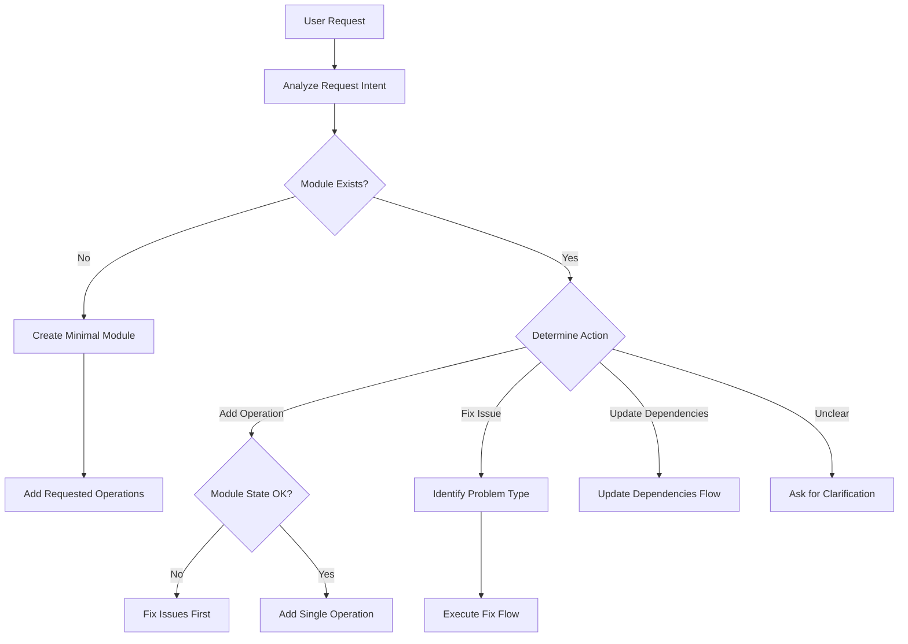

# Workflow Decision Tree

## Primary Decision Flow



## Detailed Decision Logic

### 1. Request Analysis

```javascript
function analyzeRequest(userPrompt) {
  // Extract key information
  const intent = detectIntent(userPrompt);
  const moduleName = extractModuleName(userPrompt);
  const operations = extractOperations(userPrompt);

  return {
    intent,      // 'create' | 'add' | 'fix' | 'update'
    moduleName,  // e.g., 'github-github'
    operations,  // ['listUsers', 'getUser', ...]
  };
}
```

### 2. Module Discovery

```javascript
function discoverModule(moduleName) {
  // Run: npx lerna list --json
  const modules = await listModules();

  // Find exact match
  let module = modules.find(m => m.name.endsWith(moduleName));

  // If no exact match, try fuzzy matching
  if (!module) {
    module = findBestMatch(moduleName, modules);
    if (module) {
      // Ask user to confirm
      const confirmed = await confirmModule(module);
      if (!confirmed) return null;
    }
  }

  return module;
}
```

### 3. State Validation

```javascript
function validateModuleState(modulePath) {
  const checks = {
    gitClean: checkGitStatus(),
    buildPasses: runBuild(),
    testsPass: runTests(),
    lintPasses: runLint()
  };

  return {
    isValid: Object.values(checks).every(v => v),
    failures: Object.entries(checks)
      .filter(([_, v]) => !v)
      .map(([k, _]) => k)
  };
}
```

## Action-Specific Flows

### Create Minimal Module

```
1. Product Discovery
   ├─ Find product package
   ├─ Install temporarily
   └─ Extract information

2. Scaffold Module
   ├─ Run Yeoman generator
   ├─ Configure basics
   └─ Install dependencies

3. Design API
   ├─ Research documentation
   ├─ Create minimal spec
   └─ One essential operation

4. Implement Connection
   ├─ Create Client class
   ├─ Add connect/disconnect
   └─ Verify connectivity

5. Add First Operation
   ├─ Simplest operation
   ├─ Proves connection works
   └─ Full test coverage

6. Document
   └─ Create USERGUIDE.md
```

### Add Single Operation

```
1. Analyze Operation
   ├─ Find in API docs
   ├─ Determine dependencies
   └─ Check if schemas exist

2. Update API Spec
   ├─ Add to api.yml
   ├─ Reuse/create schemas
   └─ Validate spec

3. Generate Interfaces
   ├─ Run code generation
   ├─ Verify build passes
   └─ Check types

4. Implement Operation
   ├─ Add to producer
   ├─ Create mappers
   └─ Handle errors

5. Test Operation
   ├─ Curl validation first
   ├─ Integration test
   └─ Unit test

6. Verify Quality
   ├─ All tests pass
   ├─ Build succeeds
   └─ No regressions
```

### Fix Issue

```
1. Diagnose Problem
   ├─ Build failure?
   ├─ Test failure?
   ├─ Lint issue?
   └─ Runtime error?

2. Determine Fix Strategy
   ├─ Code fix needed?
   ├─ Spec fix needed?
   ├─ Test fix needed?
   └─ Config fix needed?

3. Apply Fix
   ├─ Make changes
   ├─ Test locally
   └─ Verify resolution

4. Validate Fix
   ├─ Run full test suite
   ├─ Check for side effects
   └─ Ensure no regressions
```

## Decision Points

### When to Split Module

```javascript
function shouldSplitModule(operation) {
  // Different auth server
  if (operation.authServer !== module.authServer) {
    return true;
  }

  // Different client library needed
  if (operation.requiresSDK !== module.clientLibrary) {
    return true;
  }

  // User explicitly requests
  if (userRequestsSplit) {
    return true;
  }

  return false;
}
```

### When to Stop and Ask

```javascript
function shouldAskUser(confidence, attempts) {
  // Low confidence
  if (confidence < 70) {
    return true;
  }

  // Multiple failures
  if (attempts >= 3) {
    return true;
  }

  // Ambiguous intent
  if (!intent.clear) {
    return true;
  }

  // Multiple module matches
  if (modules.length > 1) {
    return true;
  }

  return false;
}
```

### Operation Dependencies

```javascript
function determineOperationOrder(operations) {
  const dependencies = {};

  operations.forEach(op => {
    // Analyze parameters
    if (op.params.includes('userId')) {
      dependencies[op.name] = ['getUser', 'getCurrentUser'];
    }

    // Analyze return types
    if (op.returns === 'Token') {
      // Other ops might need this token
      dependencies.othersNeedToken = op.name;
    }
  });

  return topologicalSort(operations, dependencies);
}
```

## Confidence Scoring

### Calculation

```javascript
function calculateConfidence(decision) {
  let score = 100;

  // Deductions
  if (!exactDocumentationMatch) score -= 20;
  if (!testedWithCurl) score -= 15;
  if (assumptionsMade) score -= 10;
  if (patternGuessed) score -= 25;

  // Bonuses
  if (existingPatternFound) score += 10;
  if (officialDocsUsed) score += 5;

  return Math.max(0, Math.min(100, score));
}
```

### Thresholds

- **90-100%**: Proceed automatically
- **70-89%**: Proceed with documentation
- **50-69%**: Try alternative approach
- **<50%**: Stop and ask user

## Recovery Paths

### From Build Failure

```
Build Fails
    ↓
Fix Compilation Error
    ↓
Build Again
    ↓
Still Fails? → Check Dependencies
    ↓
Still Fails? → Fix API Spec
    ↓
Still Fails? → Ask User
```

### From Test Failure

```
Test Fails
    ↓
Is it API mismatch? → Fix mappers
    ↓
Is it Auth issue? → Verify credentials
    ↓
Is it Test bug? → Fix test
    ↓
Still Fails? → Debug with curl
    ↓
Still Fails? → Ask User
```

## Module Routing

### Determining Target Module

```javascript
function routeOperationToModule(operation, modules) {
  // Check operation path/tag
  const resourceType = extractResourceType(operation);

  // Map to module pattern
  // github-github: base operations
  // github-github-issues: issue operations
  // github-github-actions: action operations

  if (resourceType === 'issues') {
    return modules.find(m => m.name.includes('-issues'));
  }

  // Default to base module
  return modules.find(m => !m.name.includes('-issues') &&
                           !m.name.includes('-actions'));
}
```

## Success Criteria

### Per Action Type

**Create Module**:
- Connection established ✓
- One operation works ✓
- Tests pass ✓
- USERGUIDE.md complete ✓

**Add Operation**:
- Operation works ✓
- Tests pass ✓
- No regressions ✓
- Build succeeds ✓

**Fix Issue**:
- Problem resolved ✓
- All tests pass ✓
- No new issues ✓
- Clean git status ✓